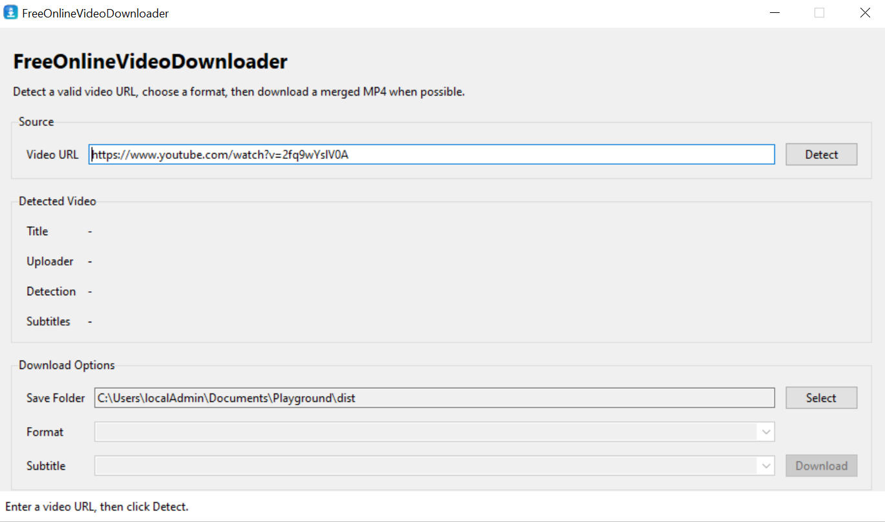
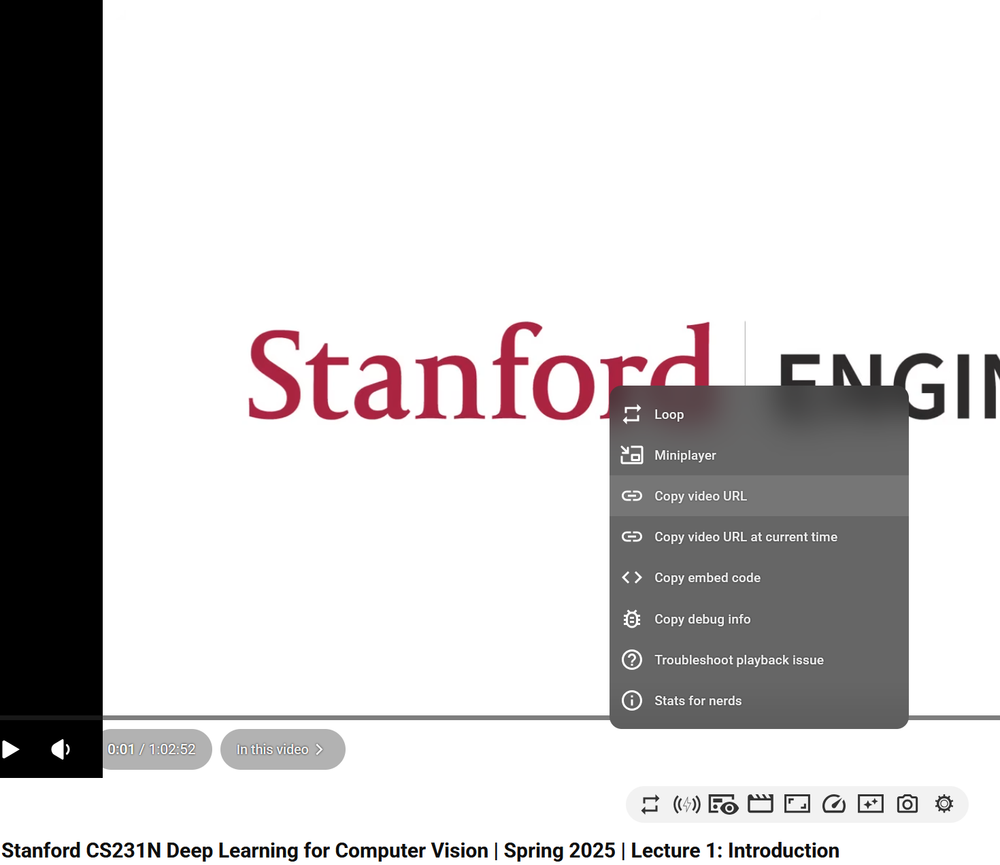
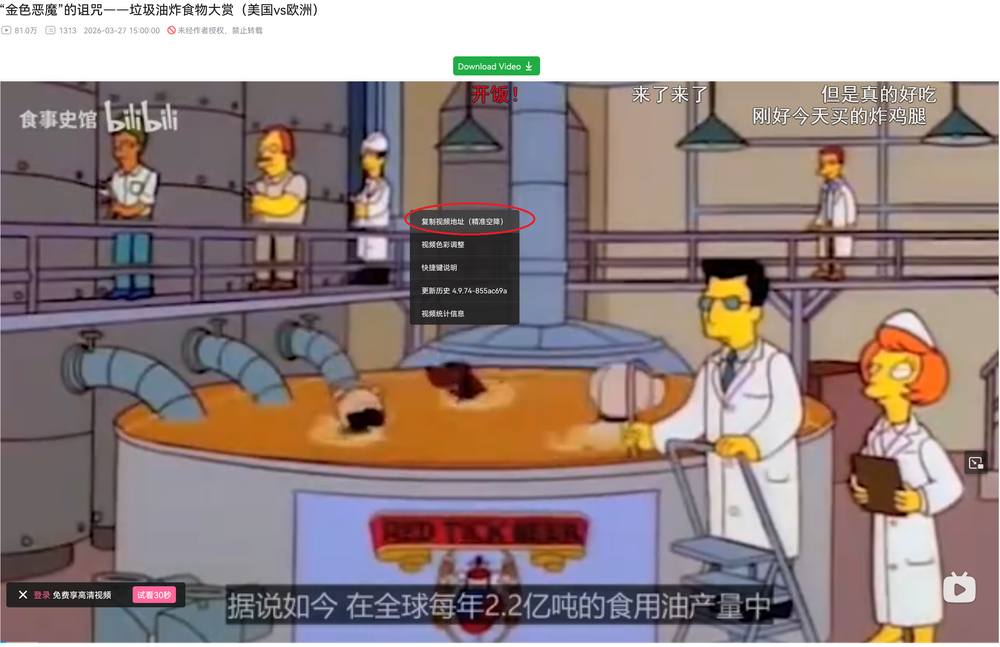
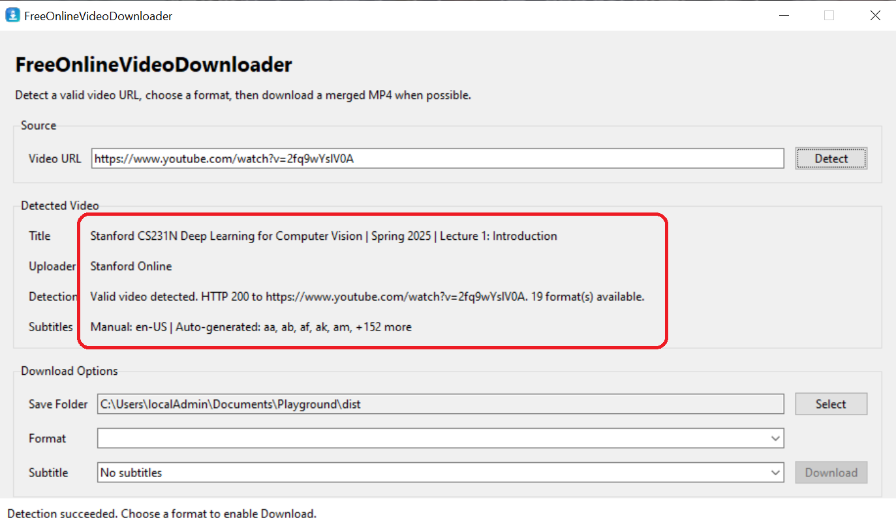
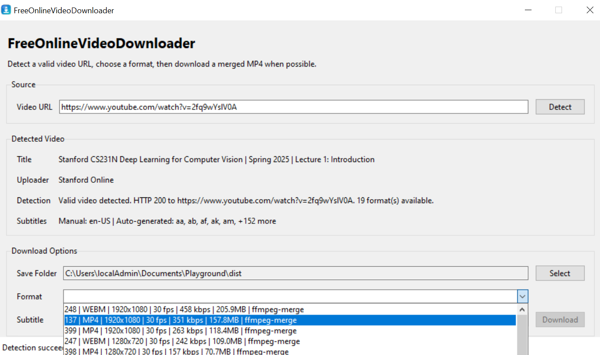
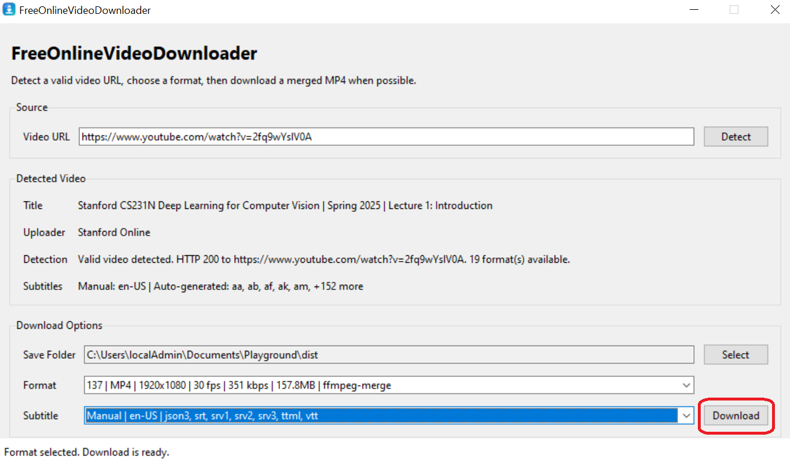
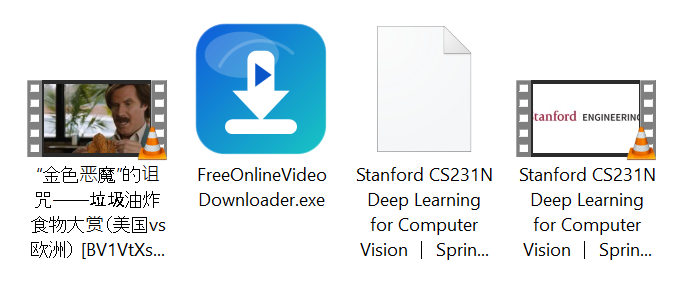

# FreeOnlineVideoDownloader

FreeOnlineVideoDownloader is a Windows-focused video downloader with both a desktop GUI and a command-line interface. It uses `yt-dlp` for site extraction and `ffmpeg` for stream merging, so it can work with more than just YouTube when the target site is supported by `yt-dlp`.

## Features

- GUI workflow for URL detection, format selection, subtitle selection, and download
- Command-line workflow for quick inspection and interactive downloads
- Support for sites handled by `yt-dlp`, including YouTube and Bilibili
- Detects available subtitles and lets the user download one subtitle track
- Bundled `ffmpeg` support for merged MP4 output when separate video/audio streams are selected
- One-file Windows `exe` build via PyInstaller

## Screenshots

### Main Window



## Requirements

### Running the packaged EXE

- Windows 10 or newer
- Internet access to the target video site

### Development and build requirements

- Windows
- Python 3.10 or newer
- Tkinter available in your Python installation
- `yt-dlp`
- `ffmpeg` and `ffprobe` if you want merged MP4 output from split streams

Tested locally with Python 3.14 on Windows.

## GUI Usage

### Use the EXE file

Download the latest `FreeOnlineVideoDownloader.exe` from GitHub Releases and double-click it to start.

If you are using a local source checkout and there is no release asset yet, build the executable first and then run:

```text
dist\FreeOnlineVideoDownloader.exe
```


### Find the URL you want to download

#### For YouTube

Right-click the video and copy the video URL.



#### For Bilibili

Right-click the video and copy the video URL.



### Detect the video info

After pasting the URL, click `Detect`. The application will show the detected title, uploader, available formats, and subtitle information.



### Select the video format to download

You must select one format before you can start the download.



### Start download

You can also select the `Save Folder` as the download destination. When all required options have been selected, click the `Download` button.



### Result

By default, the save folder is the directory where the `exe` file is located, unless you choose a different folder.



### Run the GUI from source

```powershell
python .\free_online_video_downloader_gui.py
```

Basic workflow:

1. Enter a video URL.
2. Click `Detect`.
3. Choose a format.
4. Optionally choose a subtitle track.
5. Choose the save folder.
6. Click `Download`.

The GUI currently includes:

- URL input and detect button
- Format dropdown
- Subtitle dropdown
- Save folder selector
- Bottom status strip with on-demand progress display

## Command-Line Usage

Run with the default test URL:

```powershell
python .\free_online_video_downloader.py
```

Inspect a specific URL without downloading:

```powershell
python .\free_online_video_downloader.py "https://www.bilibili.com/video/BV1VtXsBdEDT?t=2.3" --test-only
```

Download to a custom folder:

```powershell
python .\free_online_video_downloader.py "https://www.youtube.com/watch?v=2fq9wYslV0A" -o .\downloads
```

Skip the `yt-dlp` install confirmation prompt:

```powershell
python .\free_online_video_downloader.py --yes
```

Useful CLI options:

- `--test-only`: inspect connectivity and available formats without downloading
- `-o` / `--output`: choose the output folder
- `--no-auto-install`: do not auto-install `yt-dlp`
- `--yes`: auto-confirm the local `yt-dlp` install prompt

## Build the EXE

This repository intentionally ignores local build dependencies such as `.vendor`, `.pyinstaller_vendor`, and `tools/`. Before building the `exe`, recreate them locally or in CI.

### 1. Install `yt-dlp` into `.vendor`

```powershell
python -m pip install --disable-pip-version-check --upgrade --target .\.vendor yt-dlp
```

### 2. Install PyInstaller into `.pyinstaller_vendor`

```powershell
python -m pip install --disable-pip-version-check --upgrade --target .\.pyinstaller_vendor pyinstaller
```

### 3. Download and extract FFmpeg

The build script scans `tools\ffmpeg\` recursively and bundles the first `ffmpeg.exe` and `ffprobe.exe` it finds there.

Example setup:

```powershell
$ProgressPreference = 'SilentlyContinue'
New-Item -ItemType Directory -Force -Path .\tools | Out-Null
Invoke-WebRequest -Uri 'https://www.gyan.dev/ffmpeg/builds/ffmpeg-release-essentials.zip' -OutFile '.\tools\ffmpeg-release-essentials.zip'
if (Test-Path '.\tools\ffmpeg') {
    Remove-Item -Recurse -Force '.\tools\ffmpeg'
}
Expand-Archive -Path '.\tools\ffmpeg-release-essentials.zip' -DestinationPath '.\tools\ffmpeg'
```

### 4. Build

```powershell
powershell -NoProfile -ExecutionPolicy Bypass -File .\build_free_online_video_downloader_exe.ps1
```

Expected output:

```text
dist\FreeOnlineVideoDownloader.exe
```

## GitHub Actions Build

This repository includes a GitHub Actions workflow at `.github/workflows/build-windows-exe.yml`.

- Push to `master` or `main`: GitHub builds the Windows `exe` automatically and uploads it as a workflow artifact
- Run `Build Windows EXE` from the Actions tab: GitHub builds the `exe` on demand
- Push a version tag such as `v1.0.0`: GitHub builds the `exe`, uploads the workflow artifact, and also publishes `FreeOnlineVideoDownloader.exe` to the matching GitHub Release

Typical release flow:

```powershell
git tag v1.0.0
git push origin v1.0.0
```

After the workflow finishes:

- Download temporary build artifacts from the workflow run page under `Actions`
- Download public release binaries from the repository `Releases` page when you build from a `v*` tag

## Clean Previous Build Outputs

To remove previous build artifacts:

```powershell
powershell -NoProfile -ExecutionPolicy Bypass -File .\clean_free_online_video_downloader_build.ps1
```

This cleanup script removes build caches and packaged executables, but it does not remove your source files, `assets/`, or the ignored dependency directories unless you explicitly delete them yourself.

## Third-Party Components

This project depends on several third-party tools and libraries. Their own licenses remain separate from the GPL license used by this repository.

- `yt-dlp`  
  Used for site extraction, metadata detection, subtitle detection, and media downloading.  
  Upstream: [yt-dlp/yt-dlp](https://github.com/yt-dlp/yt-dlp)  
  License: The Unlicense

- `FFmpeg` and `ffprobe`  
  Used for muxing, remuxing, post-processing, and merged MP4 output.  
  Upstream: [FFmpeg](https://ffmpeg.org/)  
  Legal and licensing notes: [FFmpeg License and Legal Considerations](https://www.ffmpeg.org/legal.html)  
  License note: FFmpeg is generally available under LGPL v2.1 or later, but some build configurations include GPL components. The exact obligations depend on the specific binary build you distribute.

- `PyInstaller`  
  Used to build the Windows one-file executable.  
  Upstream: [PyInstaller](https://pyinstaller.org/)

If you distribute packaged binaries, review the licenses of all bundled third-party components and make sure your release process includes any notices or source-distribution steps required by those licenses.

## Copyright and License

Copyright (C) 2026 FreeOnlineVideoDownloader contributors.

This repository is licensed under the GNU General Public License v3.0 only. The full license text is included in [LICENSE](LICENSE).
